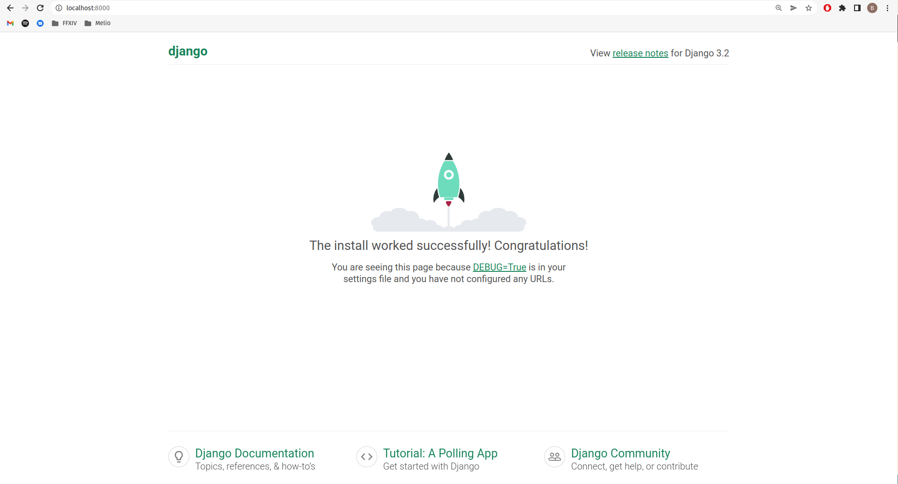

# Django and Docker Tutorial

## What this tutorial will cover

+ A **Docker** container to serve...
+ A **Django** project with a **PostgreSQL** database...
+ Using **Bootstrap 4** and...
+ A simple **Vue.js** frontend...
+ And with basic authentication using **Keycloak**

## Part 1: Setting up Docker, Django and Postgres

### Setting up the project and creating a git repo

Now navigate to GitHub in your browser and create a new repository called `django_docker_tutorial`.
I chose to add a pre-defined `.gitignore` and the Apache License 2.0.

Locally, clone the repo:

```sh
git clone git@github.com:{your_username}/django_docker_tutorial.git
cd django_docker_tutorial
```

I will assume you will commit and push regularly throughout the tutorial.

### Writing the Dockerfile

Create a new file named `Dockerfile` in this directory, and add the following to it:

```dockerfile
# syntax=docker/dockerfile:1
FROM python:3
ENV PYTHONDONTWRITEBYTECODE=1
ENV PYTHONUNBUFFERED=1
WORKDIR /code
COPY requirements.txt /code/
RUN pip install -r requirements.txt
COPY . /code/
```

### Adding Python requirements

You will see in the Dockerfile that we copy a file named `requirements.txt`.
Create that file in the root directory of the project, and add the following to it:

```txt
Django>=3.0,<4.0
psycopg2>=2.8
```

You will see we are using `Django` (obviously). The [psycopg2 package](https://pypi.org/project/psycopg2/) is:

> "the most popular PostgreSQL database adapter for the Python programming language"

### Writing the docker-compose file

Now create a new file named `docker-compose.yml`. This file describes the services
that make up the software application. Add the following to it:

```yml
version: "3.9"

services:
  db:
    image: postgres
    volumes:
      - ./data/db:/var/lib/postgresql/data
    environment:
      - POSTGRES_NAME=postgres
      - POSTGRES_USER=postgres
      - POSTGRES_PASSWORD=postgres
  web:
    build: .
    command: python manage.py runserver 0.0.0.0:8000
    volumes:
      - .:/code
    ports:
      - "8000:8000"
    environment:
      - POSTGRES_NAME=postgres
      - POSTGRES_USER=postgres
      - POSTGRES_PASSWORD=postgres
    depends_on:
      - db
```

You will see that there are 2 services, the `db` (Postgres database) and the `web` (Django) project.

### Creating the Django Project

Now create the Django project. We will name it `the_django_project` just to be generic.

```sh
sudo docker-compose run web django-admin startproject the_django_project .
```

If you are running Docker on Linux, the files django-admin created are owned by root.
This happens because the container runs as the root user.
Change the ownership of the new files:

```sh
sudo chown -R $USER:$USER .
```

You will see a new folder named `the_django_project` in the root directory and
some python files inside it that configure a default Django project.

You will also see that we have a new folder `data/db`.
Where did this come from? Well, if you look in the `docker-compose.yml` file,
you will see that the `db` services uses `./data/db` as a volume to hold the
Postgres database.
This should therefore be gitignored.
Open your `.gitignore` file and add the following at the bottom:

```yml
# Custom
data/
```

### It's Alive

We are now at the stage where we can actually run the server (even though there
is nothing much to see). Do this by running:

```sh
docker-compose up
```

(Note: in Linux if you see a bunch of Permission errors, re-run the `chown` command from before)

Now direct your browser to `http://localhost:8000/` and you should see:



You have now successfully run a "Hello World" Django application on Docker!

### Hooking up the database

Although we have created the Django application, it is using the default sqlite
database. We need to tell the Django application to use the Postgres database.
Do this by opening `the_django_project/settings.py` and altering the following
constant declaration.

Change:

```py
DATABASES = {
    'default': {
        'ENGINE': 'django.db.backends.sqlite3',
        'NAME': BASE_DIR / 'db.sqlite3',
    }
}
```

To:

```py
import os

# ...

DATABASES = {
    'default': {
        'ENGINE': 'django.db.backends.postgresql',
        'NAME': os.environ.get('POSTGRES_NAME'),
        'USER': os.environ.get('POSTGRES_USER'),
        'PASSWORD': os.environ.get('POSTGRES_PASSWORD'),
        'HOST': 'db',
        'PORT': 5432,
    }
}
```

Now do a first-time database migration by running:

```sh
sudo docker-compose run web python manage.py migrate
```

You should see a few database tables being created, mostly for the built in
auth and admin apps:

```sh
Creating django_docker_tutorial_web_run ... done
Operations to perform:
  Apply all migrations: admin, auth, contenttypes, sessions
Running migrations:
  Applying contenttypes.0001_initial... OK
  Applying auth.0001_initial... OK
  Applying admin.0001_initial... OK
  Applying admin.0002_logentry_remove_auto_add... OK
  Applying admin.0003_logentry_add_action_flag_choices... OK
  Applying contenttypes.0002_remove_content_type_name... OK
  Applying auth.0002_alter_permission_name_max_length... OK
  Applying auth.0003_alter_user_email_max_length... OK
  Applying auth.0004_alter_user_username_opts... OK
  Applying auth.0005_alter_user_last_login_null... OK
  Applying auth.0006_require_contenttypes_0002... OK
  Applying auth.0007_alter_validators_add_error_messages... OK
  Applying auth.0008_alter_user_username_max_length... OK
  Applying auth.0009_alter_user_last_name_max_length... OK
  Applying auth.0010_alter_group_name_max_length... OK
  Applying auth.0011_update_proxy_permissions... OK
  Applying auth.0012_alter_user_first_name_max_length... OK
  Applying sessions.0001_initial... OK
```

Run the server again and direct your browser to `localhost:8000` to make sure
nothing is broken.

## Part 2: Creating a Django Model, View and Template

TODO

## References

1. [Quickstart: Compose and Django](https://docs.docker.com/samples/django/)
